# App Playpen

A python & Xcode GUI tool to simplify building read-only disk image application launchers to workaround enterprise unfriendly applications. 
It simplifies the process by adding all the required application information by selecting an enterprise unfriendly application and then allows additional editing for special use cases. 
In addition, you can add command or scripts of your choosing that can be executed before & after launch or when quitting the enterprise unfriendly application.

# Contents
- [App Playpen](#app-playpen)
- [Contents](#contents)
- [Purpose](#purpose)
- [Download](#download)
- [Contact](#contact)
- [Install](#install)
- [Uninstall](#uninstall)
- [System Requirements](#system-requirements)
  * [Tools](#tools)
- [Terminology](#terminology)
  * [Components](#components)
  * [Fields](#fields)
  * [Exceptional Requirement Examples](#exceptional-requirement-examples)
    + [Application that require insecure permissions](#application-that-require-insecure-permissions)
    + [Application that updates with every launch](#application-that-updates-with-every-launch)
    + [Application that requires additional configuration post-launch](#application-that-requires-additional-configuration-post-launch)
    + [Application that requires to be launched by a specific user or group](#application-that-requires-to-be-launched-by-a-specific-user-or-group)
- [How to use App Playpen](#how-to-use-app-playpen)
  * [Unidentified Developer](#unidentified-developer)
  * [Review Code & Compile](#review-code---compile)
  * [Example - Creating a Launcher & Disk Image with App Playpen](#example---creating-a-launcher---disk-image-with-app-playpen)
    + [Launch App Playpen](#launch-app-playpen)
    + [Select your App](#select-your-app)
    + [Import App Metadata](#import-app-metadata)
    + [Disk Image Customization](#disk-image-customization)
    + [Start Build Process](#start-build-process)
    + [Prepare App for Capture](#prepare-app-for-capture)
    + [Finish Building Launcher & Disk Image](#finish-building-launcher---disk-image)
    + [Errors](#errors)
    + [Blank Build Option](#blank-build-option)
- [Compiling from Source](#compiling-from-source)
- [How Does it work?](#how-does-it-work-)
  * [Launch Process](#launch-process)
- [Update History](#update-history)

# Purpose

App Playpen is designed to be used as a convenient automation tool for building a disk image launcher in which to place applications with exceptional requirements beyond an average application. 
The outputted launcher application limits modifications to a mounted shadow image that can be discarded on logout in shared system environments 
like a student lab or can be retained in single-user systems but preventing modifications to sensitive and secured areas of the Mac file system.

# Download
"App Playpen" can be downloaded [here](../../releases/).

# Contact
If you have any comments, questions, or other input, either [file an issue](../../issues) or [send us an email](mailto:mlib-its-mac-github@lists.utah.edu). Thanks!

# Install
To install the Tool just install the .app which has everything needed compiled. It can be placed anywhere you would like.

# Uninstall
To uninstall "App Playpen" Just delete it from wherever you downloaded and placed "App Playpen" It should not create any files on your computer to work.

# System Requirements
-   **macOS** - Requires macOS High Sierra 10.13 and later. Has been tested on macOS High Sierra 10.13, macOS Mojave 10.14, and macOS Catalina 10.15.

-   **Python** - All python dependencies are built into the App Playpen application and should run with no need for a specific local version of python.

## Tools
-   **Nibbler** - In order to make this work I used Nibbler to help with GUI creation an attaching to xcode .nib file, you can find the github [here](https://github.com/macadmins/nibbler).

-   **py2app** - Used py2app in order to compile the whole project into a launchable application format, you can find more on how to use it [here](https://py2app.readthedocs.io/en/latest/)

# Terminology
## Components
For overall components of this tool, there is some terminology that we use which may not be intuitive, so I have included their definitions here:

-   **Builder** - Tool to ease and automate the process of creating a launcher script and image that contains enterprise unfriendly application
-   **Launcher** - Script that mounts image and runs additional command/scripts pre or post-launch or quitting the application
-   **Image** - Disk image that contains enterprise unfriendly application
-   **Playpen** - Used synonymously with image, describing the finished result of App Playpen

## Fields
Terminology for App Playpen field options:
-  **Name** - Name of enterprise unfriendly application 
-  **Location** - Path to enterprise unfriendly application/folder
-  **Version** - The short version for the enterprise unfriendly application - CFBundleShortVersionString 
-  **Icon** - The icon for the enterprise unfriendly application - CFBundleIconFile
-  **Identifier** - The unique identifier or the enterprise unfriendly application - CFBundleIdentifier
-  **Image Size** - The created disk image size in GB
-  **Pre-Script** - Script or command that runs just after image is mounted, before application is launched
-  **Post-Script** - Script or command that runs after image is mounted and application is opened
-  **Close-Script** - Script or command that runs after application is quit, before image in unmounted

## Exceptional Requirement Examples
Some examples of some enterprise unfriendly applicaiton exceptional requirements are:

 - ### Application that require insecure permissions 
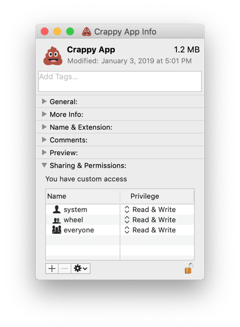

 - ### Application that updates with every launch 

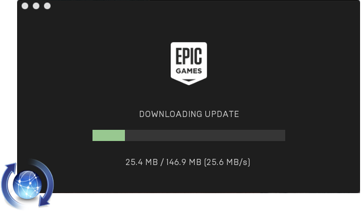

 - ### Application that requires additional configuration post-launch

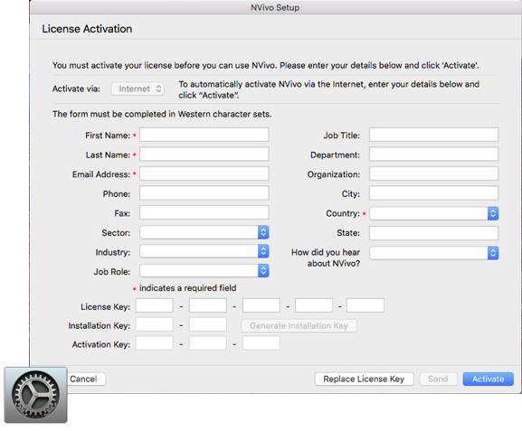

 - ### Application that requires to be launched by a specific user or group

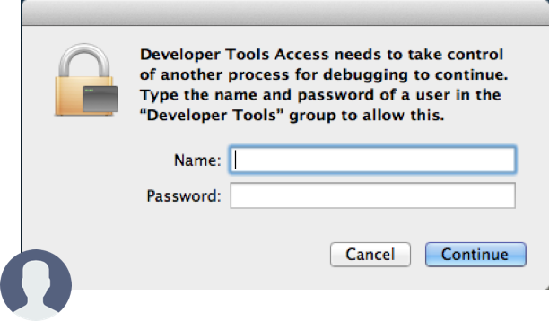


# How to use App Playpen

## Unidentified Developer
Since this tool is not signed, you will need to Ctrl+Click and select "Open" to bypass macOS warning about an 'Unidentified Developer'.

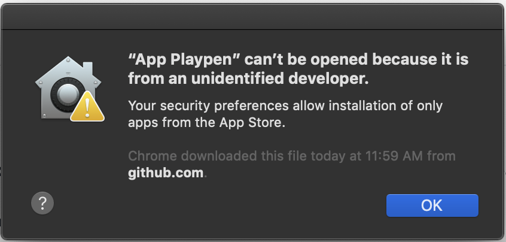

## Review Code & Compile
However, I recommend that you review the code and compile it from the source, detailed [here](#Compiling-from-Source). `Crappy_App_Logic.py` is where all the main processes occur, I would recommend you review the code here for how it works. 
App_Playpen.py handles the UI and the initial information gathering from the selected application from its plist.

You can enter your own information into the fields or you can select an app using the 'Select App' Button.
Location and icon require a file path to the respective locations for the app and icon file.

## Example - Creating a Launcher & Disk Image with App Playpen
**Here is an example using Unity Hub:**

If you don't need all the fields filled for your application, you only need the following for it to work:
-   Name
-   Location
-   Icon
-   Size

The first step is to decide which application you are going to create a playpen for. In my case, I am going to make one for unity. 

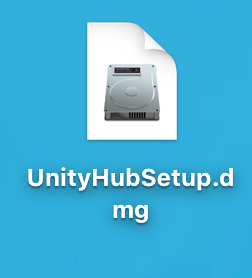

if it downloads as a .dmg open it. In the case of Unity, it is a drag and drop application so we will see this. Keep the disk mounted for later, you can close this window.

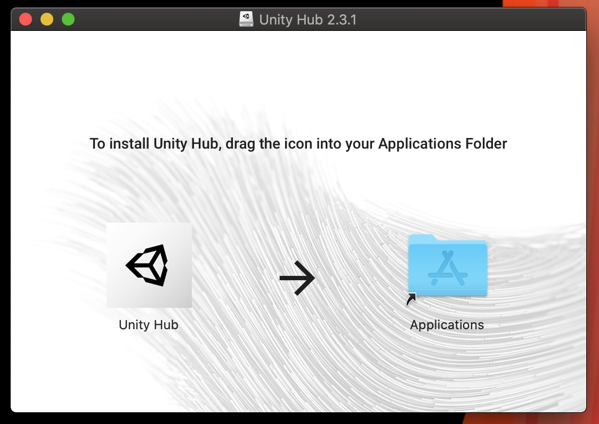

### Launch App Playpen

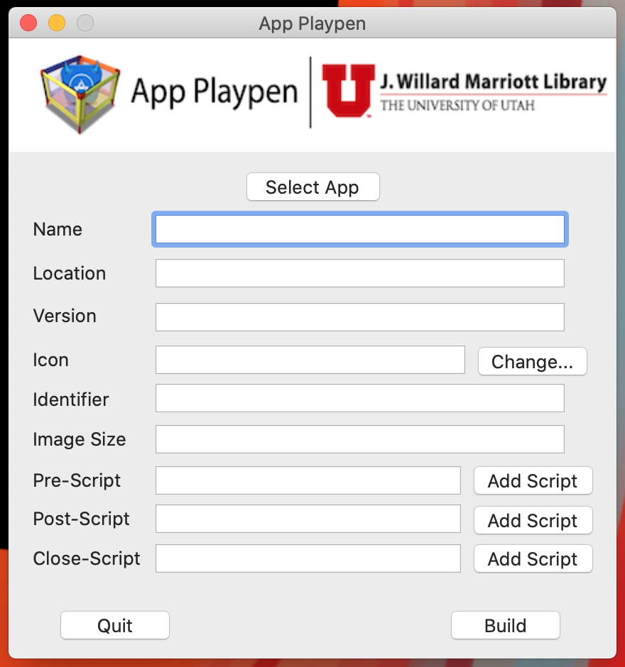

### Select your App

Select your application from wherever you downloaded it to. (on an attached disk in my case)

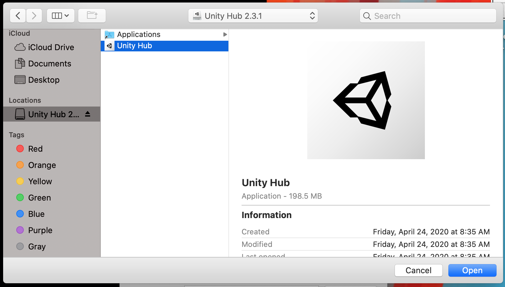

### Import App Metadata

Once you have the application you want to use, click the open button. You should now get a populated Main Menu on App Playpen.

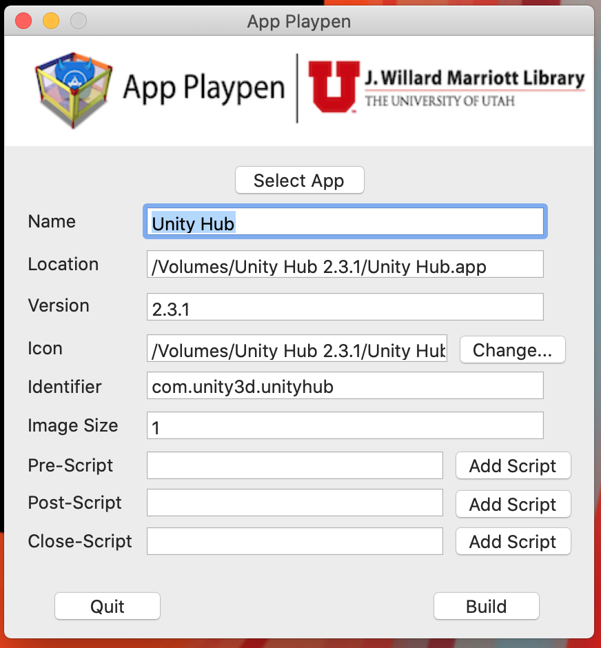

### Disk Image Customization

I want more space on my disk image to allow for some downloads, so I am going to change the size to 10gb (you cannot change this once created)

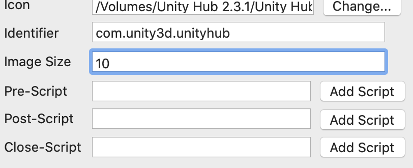

### Start Build Process

Once you are happy with the size and field entries, click the Build button. You will see this dialog prompting you to open the application. This only needs to be done if you want to do some application setup or download more onto the disk image such as texture packs or libraries.

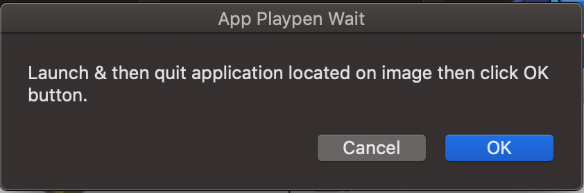

### Prepare App for Capture

Open your application in the disk image, download, and do whatever setup necessary.

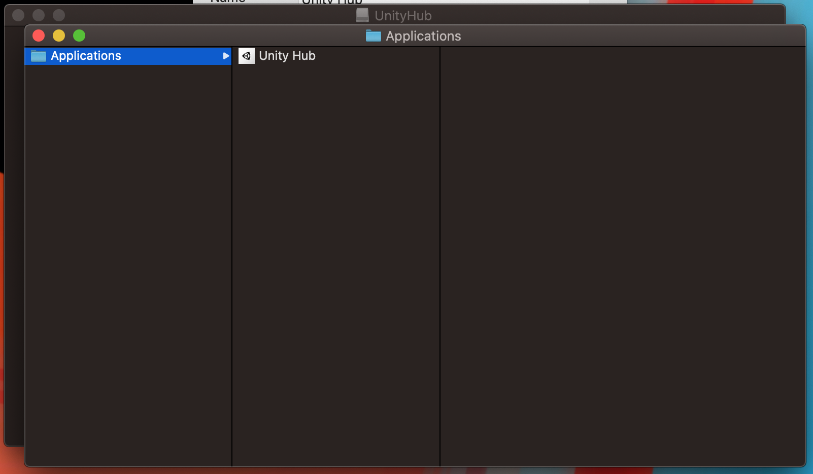

### Finish Building Launcher & Disk Image

Next, click OK on the prompt to finish building the Playpen. When it is done you will see this dialog:

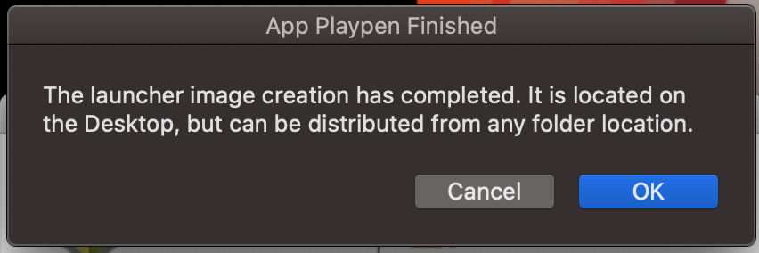

You can click okay to dismiss the dialog window. Now you will have an application Playpen identical to the real application placed on your desktop to be placed/distributed wherever needed.

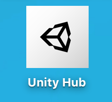

App Playpen will remain open the whole time. If you want to create another Playpen just select another application and the fields will be updated for use
in creating another wrapper.

### Errors
If an error occurs there will be a dialog window with the error displayed. There is a catch for this, but if it fails you will need to delete
the .sparseimage and .dmg if created in /tmp in order to create the app playpen.

### Blank Build Option
When creating an "App Playpen" launcher for some applications, you may not have the option to select the "real" application to gather metadata before starting the installation process. This can cause data to be lost during installation when transferring the "real" application to the  "App Playpen launcher". This "Blank Build" option allows you to create a "Blank" disk image based on two arguments, the size, and name of the disk image.

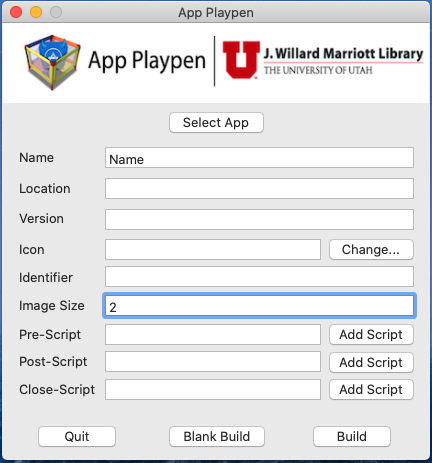

With the blank disk image created, you can install the "real" application directly to the created volume. From there, the script automatically collects the rest of the metadata and the application icon. However, if there is more than one application installed, the "App Playpen" builder may collect the incorrect information. Ideally you only want one application to be assigned to an "App Playpen" launcher. In cases where an installation has multiple applications, you can manually modify the script assignment to your desired default application.

# Compiling from Source
To turn this into a fully usable application I used py2applet. Start by going to [py2app](https://py2app.readthedocs.io/en/latest/) on how to use it.

Make the setup with `App_Playpen.py` as the source. When creating the application, I used the options:
```
--resources Path/To/App_Playpen_Logo.png,Path/To/App_Playpen.nib,Path/To/Reserve
--packages AppKit,objc
--extra-scripts Path/To/nibbler.py,Path/To/Crappy_App_Logic.py
--iconfile Path/To/PythonApplet.icns
```

# How Does it work?
App Playpen works by taking in predetermined commands and uses subprocess to create the needed files/disk images based on the information gathered by the GUI.
The User interface is created using [Nibbler](https://github.com/macadmins/nibbler) which pairs with Xcode for composing the visual aspect.
The App launcher was built using a python script, which is hidden from the user view while the application is running and prevents a second instance
of the application from being opened. Both of these scripts have been compiled into a .app format using [py2app](https://py2app.readthedocs.io/en/latest/).

With App Playpen, it also populates the plist so it has the right version and name when you get info on the Wrapper further looking like the real application.

## Launch Process
When a person uses Finder or Spotlight to find the application Unity it will find the App Playpen launcher for the  Unity application. 
When they launch App Playpen launcher application, it attaches the disk image that contains the application with a read-write shadow file in userspace. 
When the actual Unity application is launched, it may install updates that will be written to the shadow file. 
This allows Unity to update while allowing users to have restriction-free access to this enterprise unfriendly application and minimize security to overall Mac system issues do to updates.

.png)


# Update History

Date | Version | Notes
-------|-----------|-------
2020.05.07 | 1.0 | Initial release
2020.06.02 | 1.0.1 | Added Blank Build Option
2020.08.04 | 1.0.2 | Fixed bugs with script launcher
2021.02.04 | 1.0.3 | Fixed bug with app launcher script

